# Something about the CPEN 311 Lab 4

## Something about the SOF file
It is located here:
[./rtl/output_files/rc4.sof](./rtl/output_files/rc4.sof)

## Something about the status
All parts complete, including:
1. Task 1 - memory initialization
2. Task 2a/2b - Pseudorandom sequence creation and decryption with secret key
3. Task 3 - FSM to attempt to brute force all possible keys
4. Bonus - Multi-core initialization

Complete with simulations and SignalTaps

## Annotated Simulation screenshots
[./docs](./docs)
They are partitioned by task. Inside, you will find simulation screenshots and SignalTap screenshots.  

### Task 1 Simulations
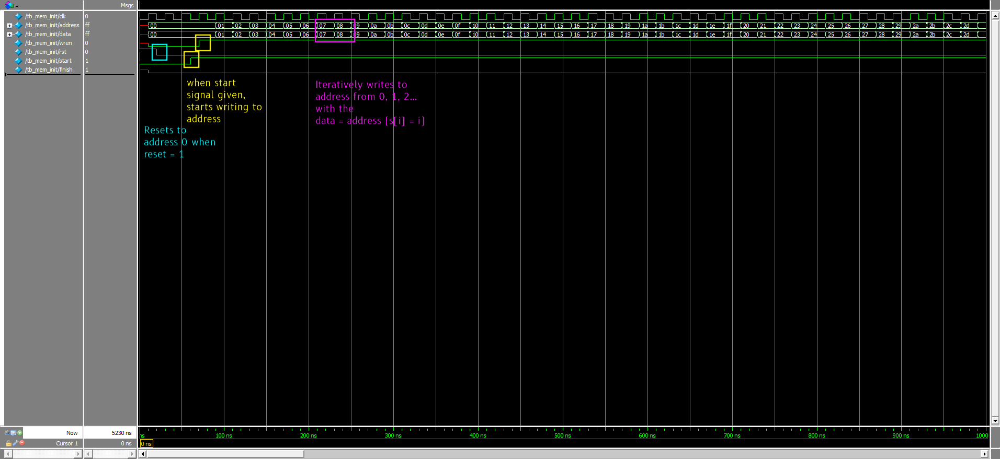

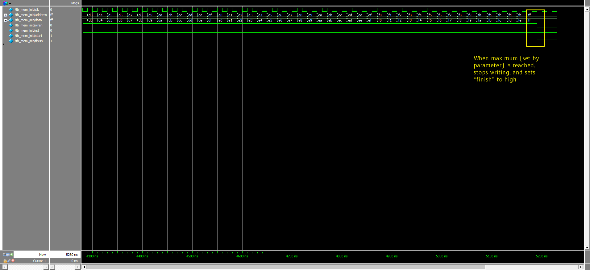

## Task 2a Simulations
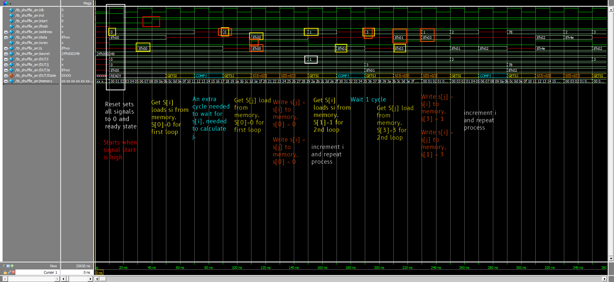

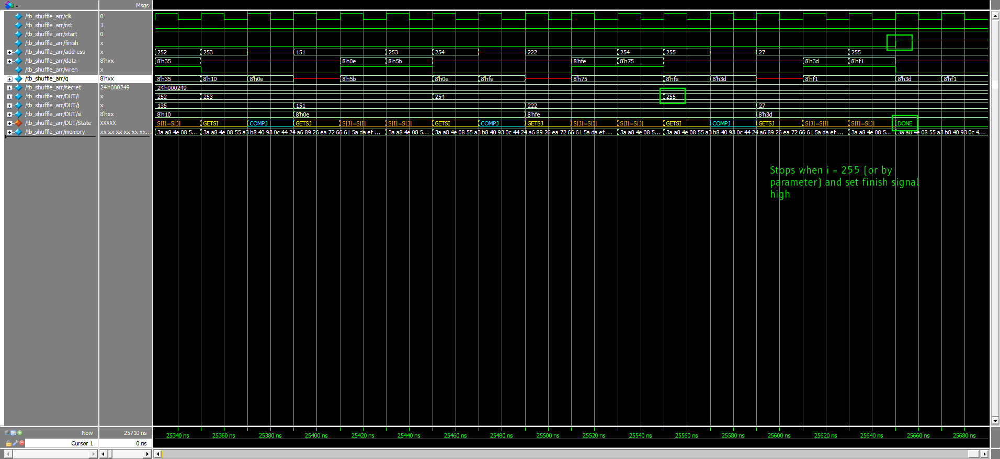

## Task 2b Simulations
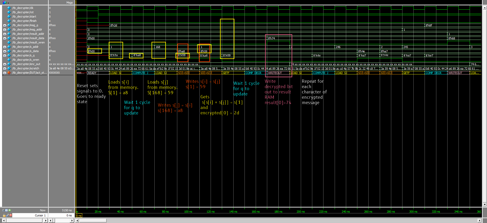

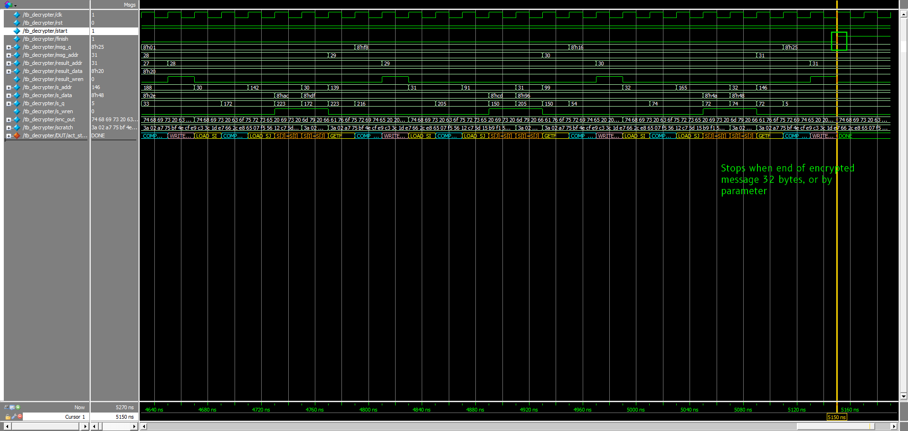

## Task 3 Simulations
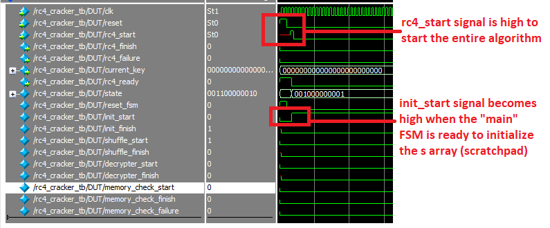
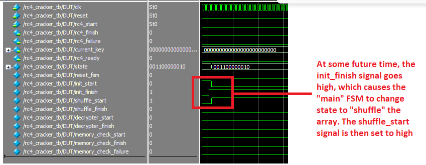
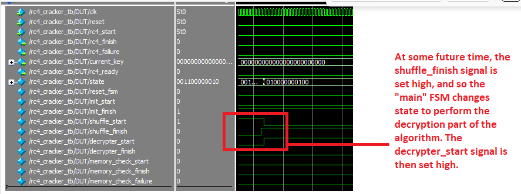
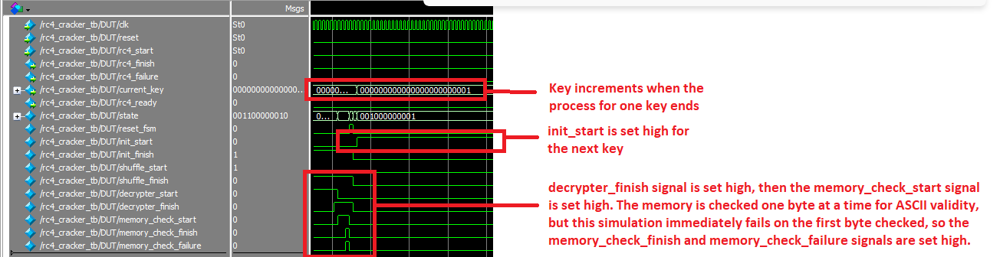

## Annotated SignalTap screenshots
[./docs](./docs)
They are partitioned by task. Inside, you will find simulation screenshots and SignalTap screenshots. 
### Task 1 SignalTap
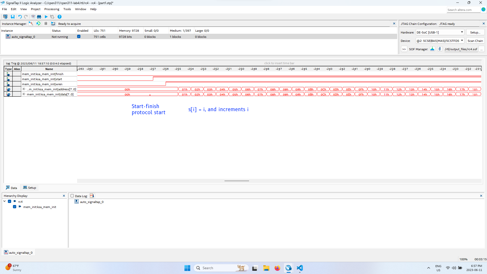

## Task 2a SignalTap
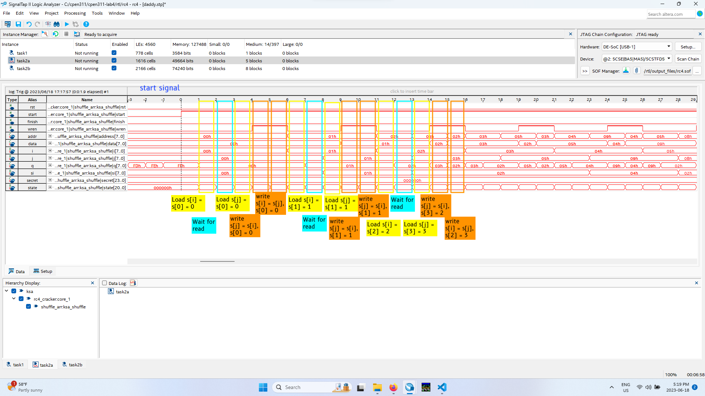

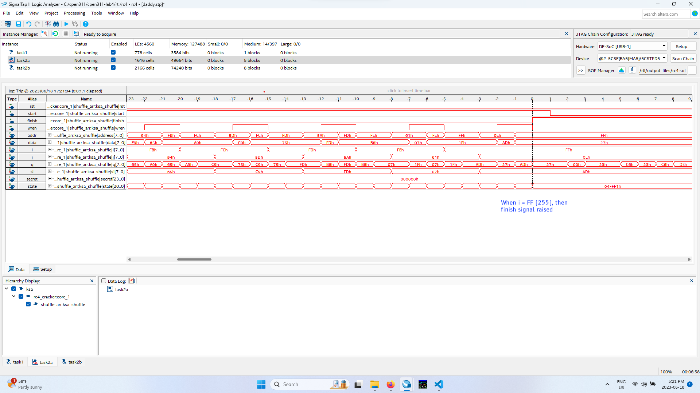

## Task 2b SignalTap
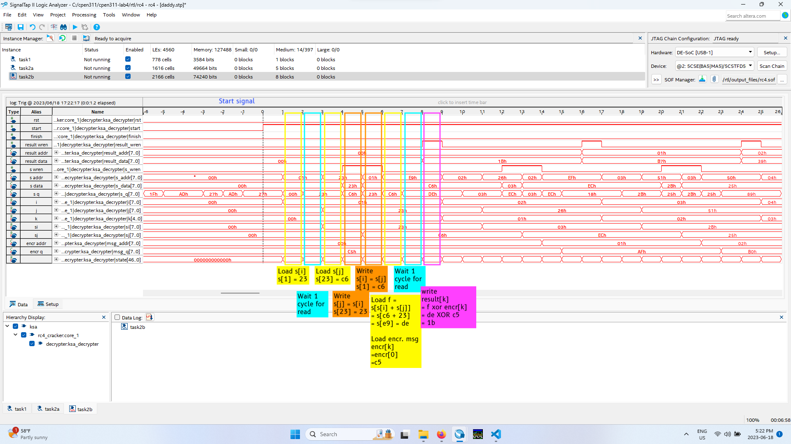

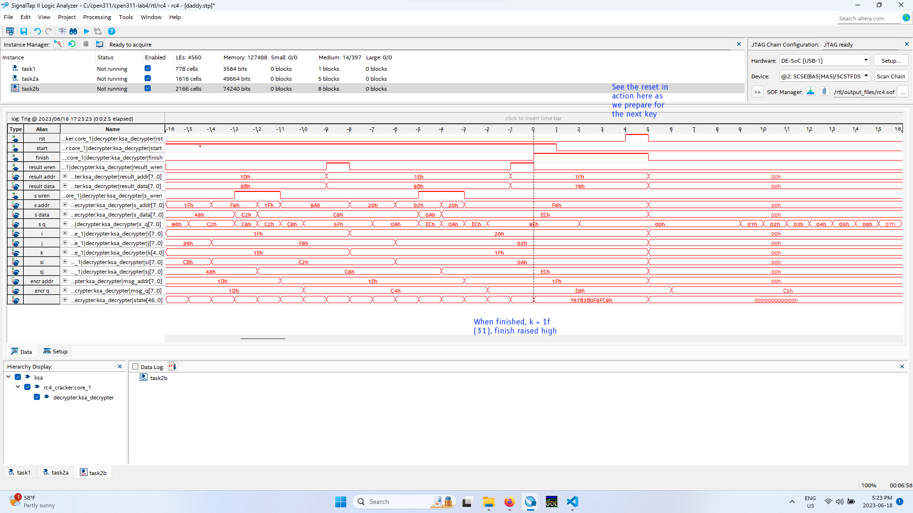

## Task 3 SignalTap
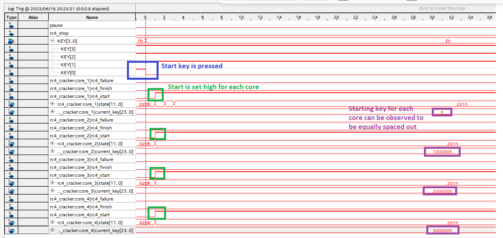
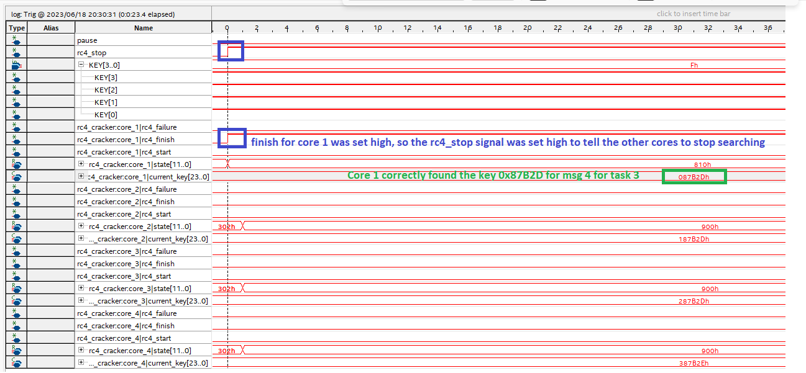
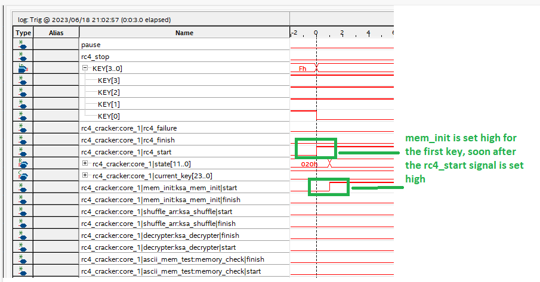
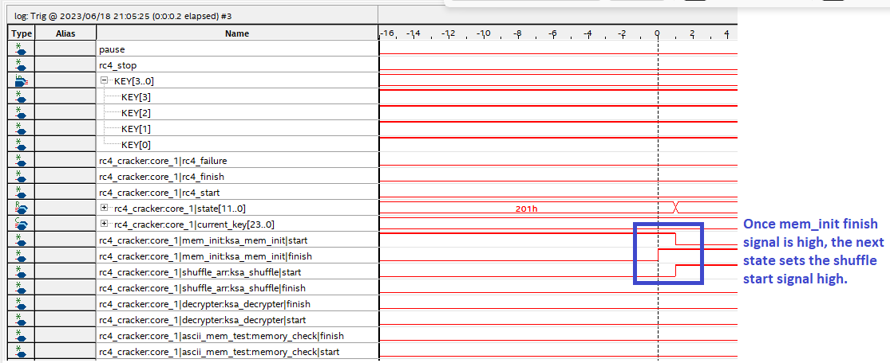
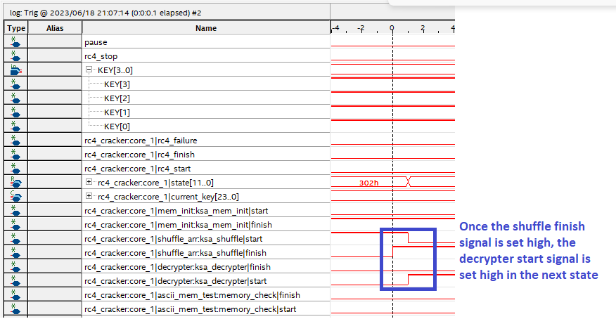
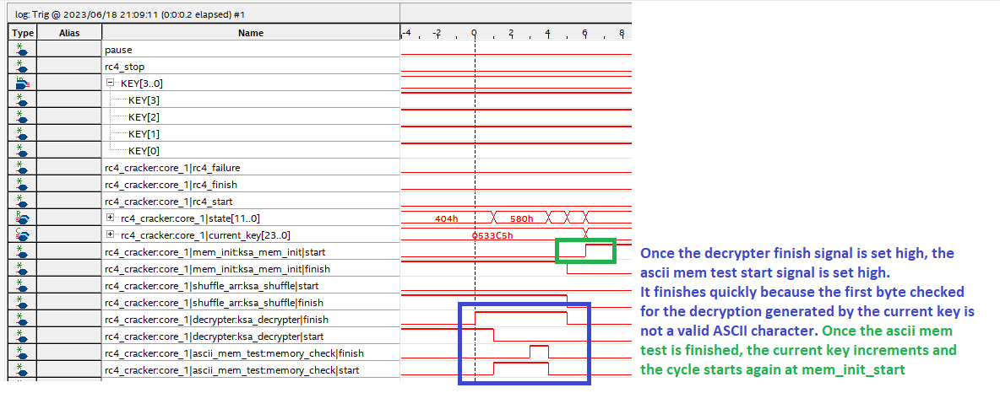

## Additional Information
None
